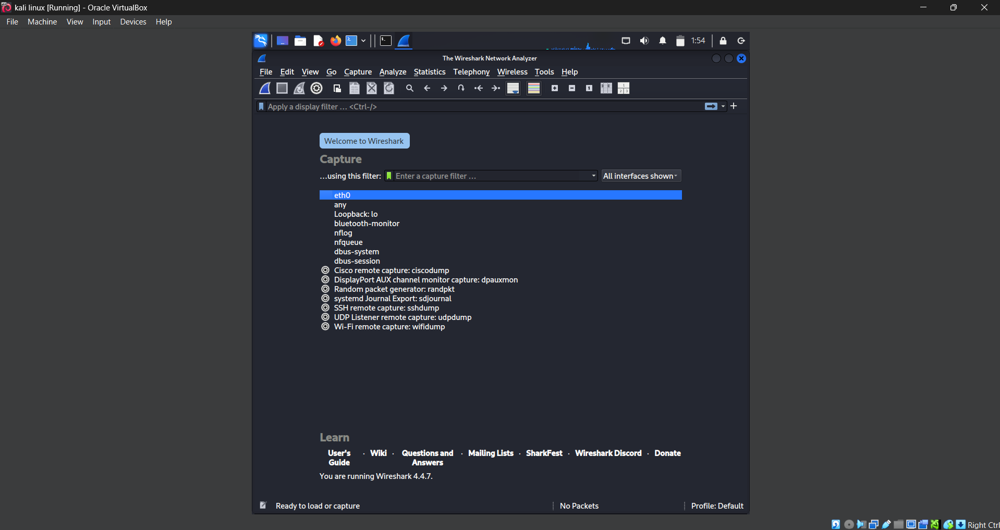
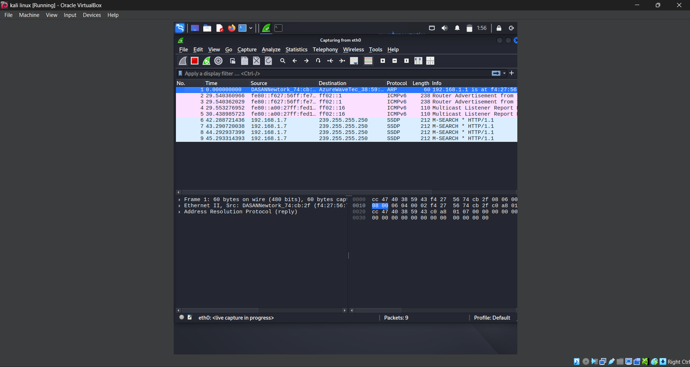

# Wireshark-Network-Capture-Analysis
Wireshark-Network-Capture-Analysis is a cybersecurity project showcasing packet capture and protocol analysis using Wireshark on Kali Linux. It includes real .pcap data, filtered views, and reports identifying HTTP, DNS, TCP, and other protocols, demonstrating hands-on network troubleshooting skills.
# Wireshark Network Traffic Capture & Analysis

## 📌 Task Overview
This project is part of a cybersecurity internship assignment.  
Objective: Capture live network packets, identify protocols, and analyze traffic using **Wireshark**.

## 🛠 Tools Used
- **Kali Linux**
- **Wireshark** (packet analyzer)

## 🔹 Steps Performed
1. Installed Wireshark on Kali Linux.
2. Started packet capture on the active network interface.
3. Generated network activity by browsing websites & pinging servers.
4. Stopped capture after ~1 minute.
5. Applied filters (HTTP, DNS, TCP) to analyze traffic.
6. Identified at least **3 different protocols**.
7. Exported the capture as a `.pcap` file.
8. Created a short analysis report.

## 📂 Repository Contents
- `network_capture.pcap` → Packet capture file.
- `capture_report.txt` → Protocols identified & details.
- `screenshots/` → Proof of capture & filtering.

## 📊 Protocols Identified
1. **HTTP** – Web traffic between browser and servers.
2. **DNS** – Domain name lookups.
3. **TCP** – Reliable transport layer communication.

## 📷 Screenshots

---

**Outcome:** Gained hands-on experience with packet analysis, protocol identification, and network troubleshooting basics.

---
